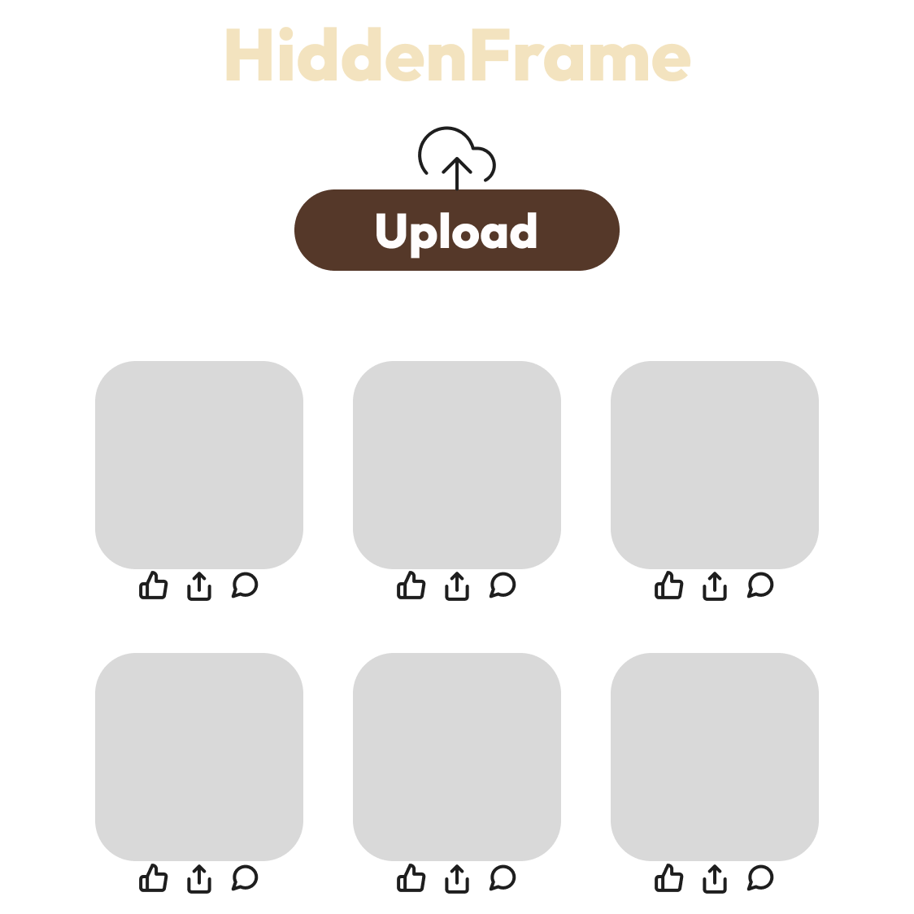
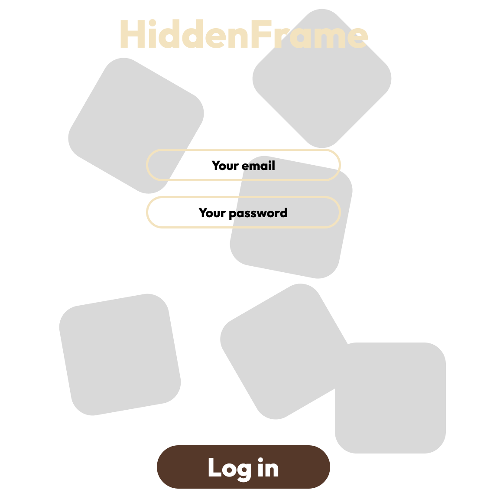
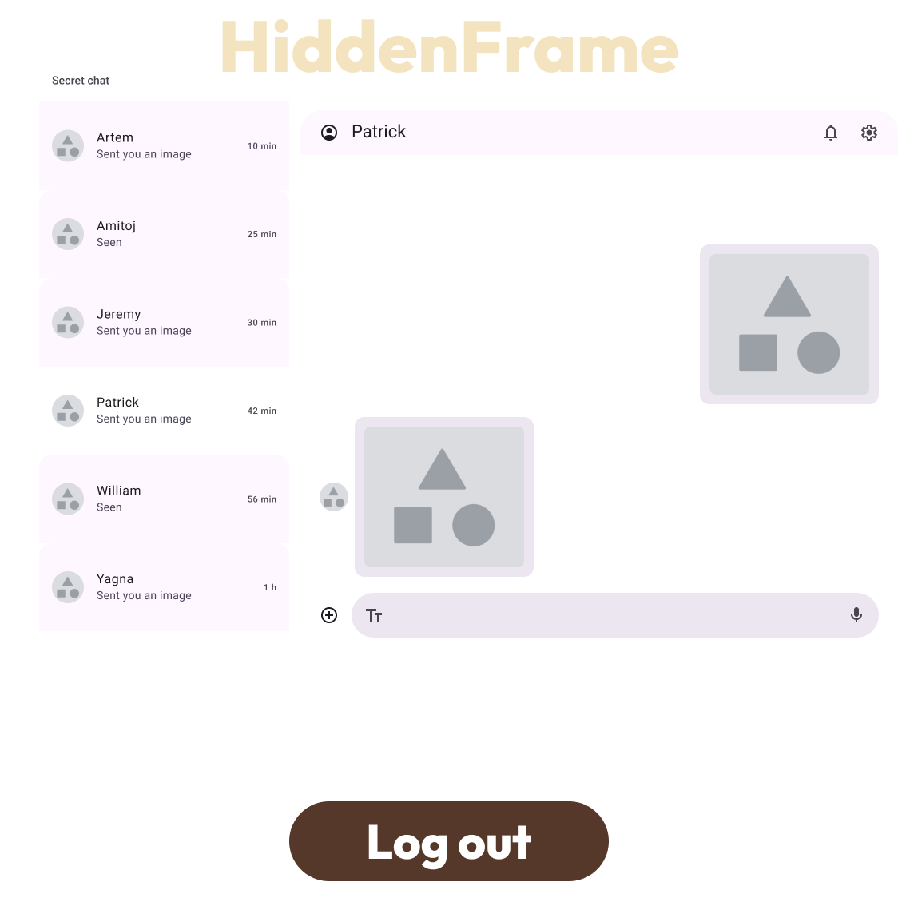

# CSCI 265 Requirements and specifications (Phase 2)

## Team name: Project HiddenFrame

## Project/product name: HiddenFrame

## Contact person and email

The following person has been designated the main contact person for questions from the reader:

 - Artem Trefilov artlov59@gmail.com

Alternate contact person:

 - Yagna Patel yagna111204@gmail.com

 # Table of Contents
 1. [Introduction and overview](#section1)
 2. [Known issues/omissions](#section2)
 3. [Product features and behavior](#section3)
	 - 3.1. [Image wall](#section3.1)
	 - 3.2. [Uploading images](#section3.2)
	 - 3.3. [Private login](#section3.3)
	 - 3.4. [Hiding messages in the pictures](#section3.4)
	 - 3.5. [Creating invites](#section3.5)
 4. [User interface and navigation](#section4)
	 - 4.1. [Main Page](#section4.1)
	 - 4.2. [Login Page](#section4.2)
	 - 4.3.  [Conversation Board Page (Secret Chat)](#section4.3)
 5. [Use cases/scenarios](#section5)
 6. [Non-functional requirements](#section6)
    - 6.1. [Public  Aspect](#section6.1)
    - 6.2. [Private Aspect](#section6.2)
    - 6.3. [Mathematics](#section6.3)
 7. [Feature prioritization](#section7)
    - 7.1. [Primary Features](#section7.1)
    - 7.2. [Secondary Features](#section7.2)
    - 7.3.  [Stretch Goals](#section7.3)
 8. [Glossary](#section8)
 9. [Appendices](#section9)

# List of Figures
- A. [Main Page](#main_page)
- B. [Login Page](#login_page)
- C. [Conversation Board Page](#convo_page)

## 1. Introduction and overview 

HiddenFrame is a unique platform that can be defined as a public picture-sharing board with hidden communication possibilities. The project is built around the idea of creating an otherwise innocent and visually appealing platform where people can share their pictures. From the user's perspective, HiddenFrame is no different from such websites as Pinterest. Users can browse pictures posted by other people and also share their own media. The public nature of the project intends to encourage as many people to participate and share their content. However, beneath this seemingly ordinary exterior lies a sophisticated system for secure, hidden communication. This system relies on a combination of various steganographic techniques to embed a message within shared images. This design makes HiddenFrame a dual-purpose system, where a relatively busy public platform serves as a cover for a covert communication medium.

Technical Implementation:
- Robust Database Management System (DBMS) for efficient data storage and retrieval
- WebRTC integration for real-time communication and potential peer-to-peer functionality
- API integrations to enhance platform features and connectivity

The unique way that HiddenFrame obfuscates hidden messages opens up a wide range of possible applications:
- Journalism: HiddenFrame provides a secure channel for communicating with those providing vital sources and information to the world’s newspapers, making sure that both the whistleblower and their mission stay protected and secretive.
- Law enforcement: HiddenFrame also provides a channel for the communication with undercover agents and secret informants, ensuring their safety and security while still being able to deliver vital information.
- Penetration testing: One can also use HiddenFrame to simulate the use of a steganographic hidden channel between a theoretical enemy and a real law enforcement agency. This way, the ability to detect the misuse of a image-based steganographic channel in a real life scenario can be tested and evaluated.

Project HiddenFrame will launch on desktop first, but is intended for the web platform, that provides best experience and features for users on large screens. This makes it possible to incorporate advanced features and a richer user experience, both of which can be difficult on mobile. The desktop-first approach focuses on building for the power and screen real estate, especially to help people share and engage around photographic products, so users get what looks/feels like a continuous and consistent experience.

## 2. Known issues/omissions 

Currently HiddenFrame will allow uploading images with embedding hidden text messages in the same images.
Our strech goals include:

- Uploading images with secret embedded audio
- Uploading images with secret embedded images
- Uploading videos with secret embedded text
- Uploading videos with secret embedded audio
- Uploading vidoes with secret embedded images

Other known omissions are:

- amount of required storage and network capacity on a per user basis
- length of time an image will be retained on the site.
- storage location of steganographic 'keys'

## 3. Product features and behaviour 

### 3.1. Image wall 
As mentioned earlier, HiddenFrame is, in brief, a picture board (like Pinterest). It will be publicly accessible and encourages the general public to share photographic content. 

This photographic content will be visible on the home page of our web app on our "Image wall", which is basically a 3x3 grid of images that "infinitely" scrolls. Having it be responsive will be one of our stretch goals.

### 3.2. Uploading images 

Our web based app will allow users to upload any images they want to our servers, which will then be displayed on our home page image wall. 

This feature will be accessible as a button on our home page right above the image wall.

The public aspect users will have some sort of image upload size limit (tbd).

### 3.3. Private login 
Select users will be using HiddenFrame's true capabilities to exchange pictures embedded with hidden data.

Our web app will have a private login page that will allow this capability. Users will be able to find this page at the `/login` endpoint (subject to change).

This web page will have a simple login form that will ask the user of some sort of identifier (username/email, tbd) and a password (using passkeys is a stretch goal)

### 3.4. Hiding messages in the pictures 

The same web based app will also have a special upload section for private users which will include a text box that allows users to type in a message that will get embedded into their image using steganography. Once the image is embedded we will provide the user with a "key" that can be used to decrypt the message from the image later. 

The text message will have some sort of size limit but we are expecting it to be a high number.

The registered users will be able to access this page after logging in from the aforementioned private login page.

### 3.5. Creating invites 

The private web page will also have a button that allows them to create a set number of invites. These invites will allow the receivers to also create an account for the private aspect.

Once a registered user has created the allocated amount of invites they will not be able to create any more invites.

The registered users will be able to access this page after logging in from the aforementioned private login page.

## 4. User interface and navigation 

The images shown for the interfaces, screens, and menus are not intended to be taken as exact literal images of the final version of the website, rather they reflect the required on-screen elements for each component, and the approximate visual appearance and location for each.

Navigation Guide/Map

1. Main Page (Feed and Upload):
	- Users can upload new images via the “Upload” button or browse through the grid of previously uploaded images. Clicking on an image in the grid will open a larger view of the image.
2. URL → Log in Page:
    - Users can go to the log in page using their URL.
3. Log in Page → Conversation Board:
	- After successfully logging in, users can access the conversation board to send secret messages. They can select a user from the list on the left and exchange images with embedded data.
4. Conversation Board (Secret Chat):
	- In the conversation board, users can view exchanged images and send new images or messages using the interface.

### 4.1 Main Page 

This is the primary screen users see after opening our website. It serves as the hub for uploading and browsing images.

Elements:

- HiddenFrame logo.
- Upload Button: A button at the center of the page, allowing users to add images.
- Image Grid: A grid layout below the upload button where previously uploaded images appear. Each image in the grid has:
	- Like Icon: Allows users to like the image.
	- Share Icon: Enables users to share the image.
	- Comment Icon: Allows users to comment on the image, likely opening a comment thread.

Navigation Flow:

- Click Upload: This takes the user to a file selection interface for image uploads.
- Click on Image in Grid: Opens a larger view of the image.

### 4.2 Login Page 

Before accessing the main interface, users must log in. The only way to get to the "log in" screen is through the URL. This screen presents a simple and user-friendly login process.

Elements:

- HiddenFrame logo.
- Falling images: random, already uploaded by users, falling images.
- Login Form: Contains two fields:
	- Email Field with placeholder "Your email".
	- Password Field with placeholder "Your password".
- Login Button: A large button labeled “Log in” at the bottom, which submits the form.

Navigation Flow:

- Submit Login Details: Successful login takes the user to the secret chat .

### 4.3 Conversation Board Page (Secret Chat) 

This is the communication hub for users to exchange images encoded with hidden messages using steganography.

Elements:

- HiddenFrame logo.
- User List (Left Panel): Displays a list of users the current user has interacted with. Each list item includes:
	- Profile Icon and Name: Displays the other user’s profile picture and name.
	- Message Status: Text like “Sent you an image” or “Seen” reflects the message exchange status.
	- Time Indicator: Shows how long ago each interaction occurred (e.g., “10 min ago”).
- Message Area (Right Panel): Displays the conversation between the user and the selected contact. Elements include:
	- Sent Images: Thumbnail images representing the conversation.
	- Text Field: Below the message area, allowing users to send messages (which will be encoded into picture, once sent) or share images .
	- Send Button: A button at the bottom of the text field to send images.

Navigation Flow:

- Select a User: Clicking a user from the list loads the conversation with that user.
- Send Image/Text: Users can send images by selecting the image or typing into the text field.

## 5. Use cases/scenarios 

Provide use cases detailing the different ways someone might actually want to use the product (e.g. a "sign in" use case, a "check balance" use case, a "make a deposit" use case, etc).

Provide scenarios that illustrate the use cases in a practical example.  (E.g. Bob has $30 to deposit and wants to deposit it, check the balance, and if there is enough then transfer $100 to his savings account, ... then walk through the Bob's actions from sign-in to sign-out.)

## 6. Non-functional requirements 
### 6.1. Public  Aspect 
One of the central pillars of project HiddenFrame is it's social media. HiddenFrame shares many of the non-functional requirements as other social media platforms. Some of the primary concerns of the Public Aspect are:
- User Privacy - HiddenFrame's public site is intended to attract a userbase posting publicly visible photographs. As such we will require a comprehensive disclaimer, permitting the public display of all photos posted to the site. Since, the public site will not (at this time) require account creation no (or minimal) user data will be stored.  
- Data use and Retention - HiddenFrame will have to comply with federal and provincial data protection laws such as the federal [Personal Information Protection and Electronic Documents Act](https://laws-lois.justice.gc.ca/PDF/P-8.6.pdf) and the BC [Personal Information Protection Act](https://www.bclaws.gov.bc.ca/civix/document/id/complete/statreg/03063_01).  
- Moderation - With the anonymous nature of the posts on the public site, it is extremely important that HiddenFrame moderate content to ensure that the pictures on the site are appropriate. 
- Hardware & Networking - Images have a relatively large storage requirement; managing server space in order to accommodate demand may be a challenge. The uploading and downloading of images can also take a significant amount of time; as such a fast internet connection for the server will be required. (The amount of storage space and network speed required will need to be quantified on a per user basis.)
- Image retention period - The permanent storage of images in bulk is unlikely to be viable. As such ProjectHidden frame will only retain images for a set period of time before deletion (exact amount of time TBC).
### 6.2. Private Aspect 
HiddenFrame's other primary feature is the steganography manipulation of images for chosen users. In addition to all of the Public Aspect Non-functional Requirements this part of the project poses its own unique challenges:
- User Privacy - Since this part of the site will require account creation HiddenFrame will have a responsibility to safeguard any user information provided. 
- Steganography keys -  If the decryption keys for image decoding are stored on the HiddenFrame servers (not ideal), they will be secured in order to ensure security.
- Misuse of HiddenFrame for Illegal activity - HiddenFrame will moderate the site for content and co-operate with law enforcement in whatever capacity is required. 
### 6.3. Mathematics 
HiddenFrame's steganographic features require that we develop a method inserting the payload into the carrier, and successfully retrieve the payload back from the carrier. As such we will require The ability to produce 'keys' which will mathematically describe the pixels modified. In order to accomplish this we will utilize the mathematical concept of a "generating set". This concept will allow us to describe the pixels we will be using for steganography.

## 7. Feature prioritization 

For some of our team members, this is our first attempt at building a website. For all of our team members, this is our first attempt to create a piece of technology using steganography techniques. The following lists include primary features, secondary features, and stretch goals for the scope of our project.

### 7.1. Primary Features 

The features our team considers mandatory for our project are:
- A webpage for creating a username for select users with access to the secret chat feature;
- A webpage for logging into a username for select users with access to the secret chat feature;
- A webpage for uploading and posting pictures to a public picture-board sharing site;
- A secret webpage for uploading an image (carrier) with a hidden message (payload) that includes a hidden message embedded within the image to send to another user. Initially, the payload will be limited to text. This webpage should also indicate if a user has received any unread secret messages, allow them to read them, and display the image they were embedded within;
- A wall/picture-board sharing webpage to view pictures the user and other users have posted;
- A program running on the server that can be called by the webpage that encodes payloads into carriers and decodes them for the recipient. Initially, this program should be able to encode text into an image using a key system where the key is embedded into the file's data;
- A key generation algorithm that fits a key into a filename of not more than 50 characters; 
- An encoding algorithm that fits not less than 2,000 characters into an image containing at least 30,000 pixels; and
- An invite webpage where select users with access to the secret chat feature may invite others to create a username and utilize the hidden feature(s).

### 7.2. Secondary Features 

Our secondary goals that our team hopes to implement depending on the remaining time available for the creation of this project include:
- A username recovery mechanism;
- One-time read/receive secret messages by removing the decode key from the file's contents;
- The ability to like and comment on pictures on the wall; and
- A separate payload type of chiptune music tones that may be encoded into images with not less than 150,000 pixels.

### 7.3. Stretch Goals 

Our team's stretch goals include that are not expected to make it into our project submission but would be nice to include if all previous items are completed ahead of schedule:
- Using a separate carrier format for both secret text messages and music files;
- Adding support for embedding images as payloads; and
- Utilizing a common encryption standard into the process so that secret messages are encrypted into and decrypted from their payloads and embedded.

## 8. Glossary 
**Steganography**: the art or practice of concealing a message, image, or file within another message, image, or file

**Public Aspect**: The portion of HiddenFrame that is accessible by the general public.

**Private Aspect**: The portion of HiddenFrame that is accessible by invitation only. Allows the use of Steganography features.

**Carrier**: A file, image, of message used to hide another message, image or file in steganography.

**Payload**: A file, image, of message hidden inside another message, image or file in steganography.

**TBD**: To be decided

## 9. Appendices 

